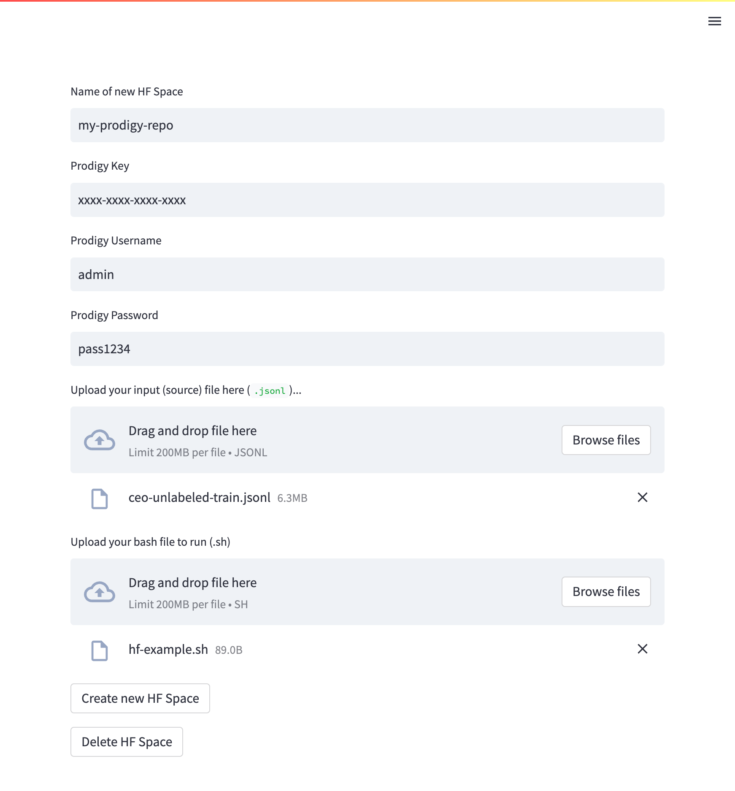

# Prodigy HuggingFace Spaces Streamlit App

## Getting started

```
python3.9 -m venv venv
source venv/bin/activate
pip install -r requirements.txt
```

## Local secrets

Create a `.env` file with:

```
HF_TOKEN=hf_xxxxxxxxxxxxxxxxxxxxxxxxxxxxx
```

where `HF_TOKEN` is your [Huggingface Hub token](https://huggingface.co/docs/hub/security-tokens).

## Running

```
python3 -m streamlit run app.py
```

## App

You will need to provide:
* Name of new repo (required)
* Prodigy license key (required)
* Prodigy username (recommended)
* Prodigy password (recommended)
* Input dataset as `.jsonl` (recommended)
* Bash script (`.sh`) (recommended)

When ready, click `Create new HF Space`

This will create your new app.


